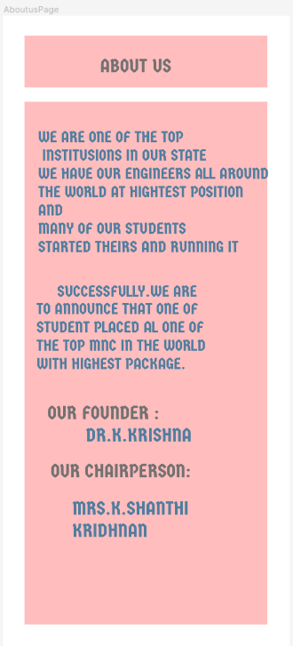

# Event Registration Web Application

# AIM:

To design, develop and deploy a web application for event registration.

# DESIGN STEPS:

# Step 1:
Use Figma Software to start making the UX Design for the Event Registration page

# Step 2:
Choose Android Large as the Screen Type and start laying out the designs as a team of 7 members.

# Step 3:
Design a Home page,Login page,Registration page,Thankyou page and Report page.

# Step 4:
Create a prototype connencting the pages and Run the flow

# Step 5:
Now the UX design for the Event registrtion page is complete.We can use this design to further develop and deploy a webpage

# Step 6:
Validate the HTML and CSS code.

# Step 7:
Publish the website in the given URL.

## DESIGN:
# Home page

# Registration page

# Thankyou page

# Login page

# Report us

# About us

# Contact us

## OUTPUT:

## Result:

Thus, UX design is designed for the Event registration page using FIGMA SOFTWARE. BY GROUP 10